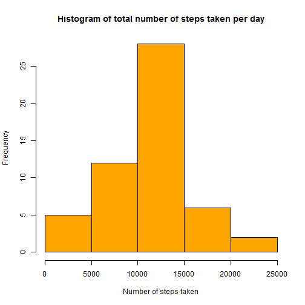
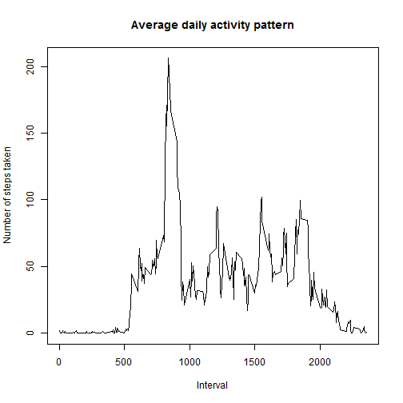
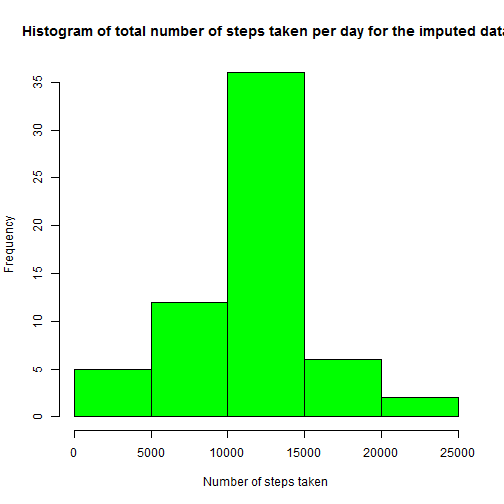
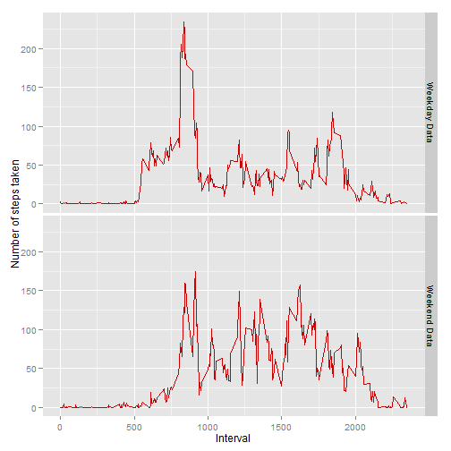

# Reproducible Research
# Peer Assessment 1

## Loading and preprocessing the data


```r
unzip(zipfile="repdata-data-activity.zip")
read_data <- read.csv("activity.csv")
```

## What is mean total number of steps taken per day?


```r
total_steps <- aggregate(steps ~ date, read_data, sum)
hist(total_steps$steps, col = 'orange', main = paste("Histogram of total number of steps taken per day"), xlab="Number of steps taken")
```

 

The mean is

```r
mean(total_steps$steps)
```

```
## [1] 10766.19
```

The median is

```r
median(total_steps$steps)
```

```
## [1] 10765
```

## What is the average daily activity pattern?


```r
fivemin_interval <- aggregate(steps ~ interval, read_data, mean)
plot(fivemin_interval$interval, fivemin_interval$steps, type="l", xlab="Interval", ylab="Number of steps taken",main="Average daily activity pattern")
```

 

The following 5-minute interval, on average across all the days in the dataset, contains the maximum number of steps


```r
fivemin_interval[which.max(fivemin_interval$steps),1]
```

```
## [1] 835
```

## Imputing missing values

Total number of missing values in the dataset (i.e. the total number of rows with NAs)

```r
sum(is.na(read_data$steps))
```

```
## [1] 2304
```

The strategy is to Use the mean value of a 5-minute interval and replace each missing value in that interval


```r
fivemin_interval_mean <- aggregate( list(steps = read_data$steps), list(interval = read_data$interval), FUN = mean, na.rm = TRUE)
imputed_value <- function(steps, interval) {
if (!is.na(steps))
        filled <- c(steps)
else filled <- (fivemin_interval_mean[fivemin_interval_mean$interval == interval, "steps"])
return(filled)
}

imputed_data <- read_data
imputed_data$steps <- mapply(imputed_value, imputed_data$steps, imputed_data$interval)
```

Draw a histogram of total number of steps taken per day for the imputed  data


```r
imputed_total_steps <- aggregate(steps ~ date, imputed_data, sum)
hist(imputed_total_steps$steps, col = 'green', main = paste("Histogram of total number of steps taken per day for the imputed data"), xlab="Number of steps taken")
```

 

The mean for modified data is

```r
mean(imputed_total_steps$steps)
```

```
## [1] 10766.19
```

The median for modified data is

```r
median(imputed_total_steps$steps)
```

```
## [1] 10766.19
```

## Are there differences in activity patterns between weekdays and weekends?

A new factor variable in the dataset "weekday_or_weekend" is created with two levels - "weekday" and "weekend" indicating whether a given date is a weekday or weekend day


```r
weekday_or_weekend <- function(date) {
    if (weekdays(as.Date(date)) %in% c("Monday", "Tuesday", "Wednesday", "Thursday", "Friday")) {
        "Weekday Data"
    } else {
        "Weekend Data"
    }
}
read_data$weekday_or_weekend <- as.factor(sapply(read_data$date, weekday_or_weekend))
```

Using "ggplot2" package, a panel plot is created containing a time series plot (i.e. type = "l") of the 5-minute interval (x-axis) and the average number of steps taken, averaged across all weekday days or weekend days (y-axis)


```r
fivemin_interval <- aggregate(steps ~ interval + weekday_or_weekend, read_data, mean)
library(ggplot2)
ggplot(fivemin_interval, aes(interval, steps)) + geom_line(colour="#CC0000") + facet_grid(weekday_or_weekend ~ .) + xlab("Interval") + ylab("Number of steps taken")
```

 
